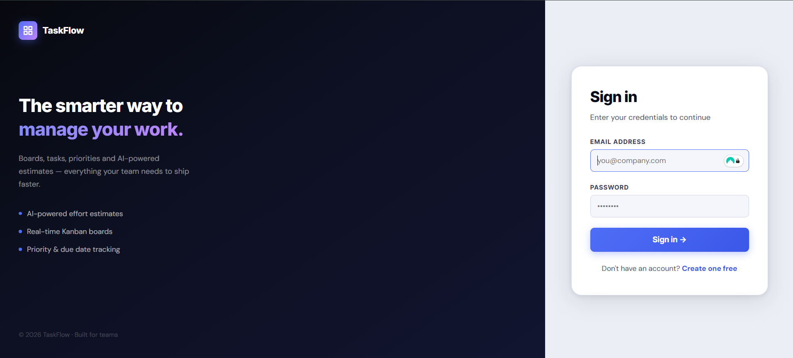
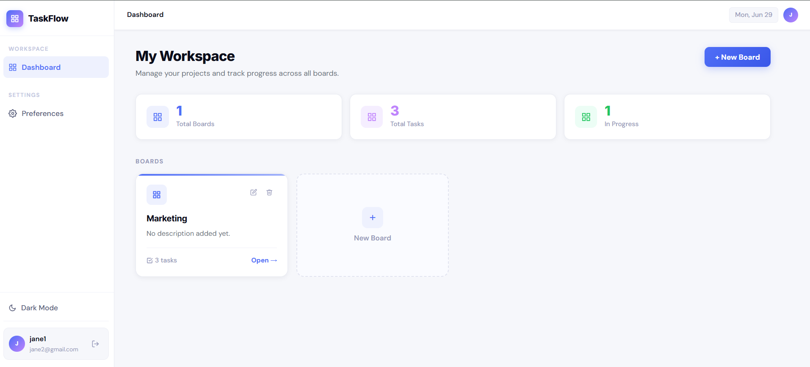
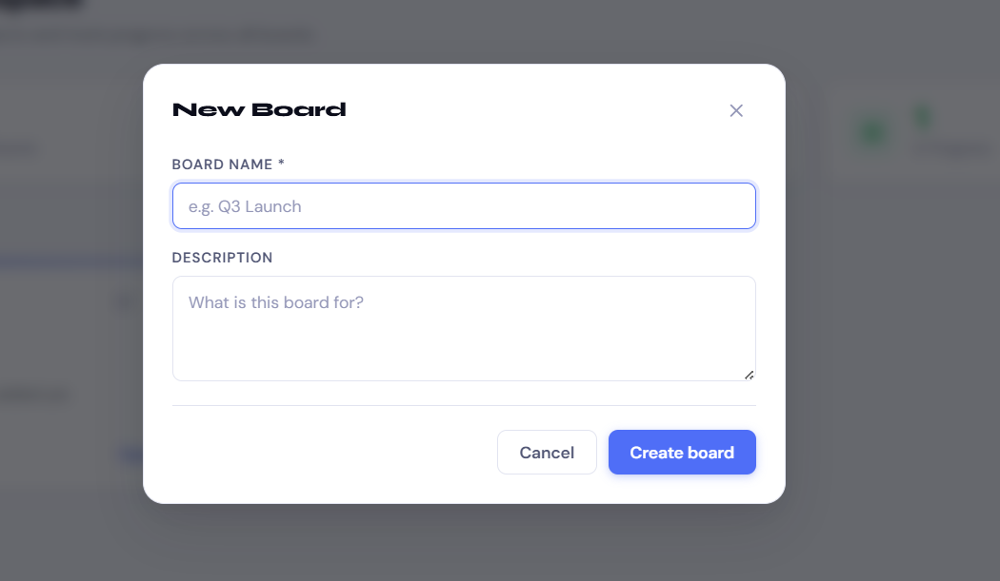
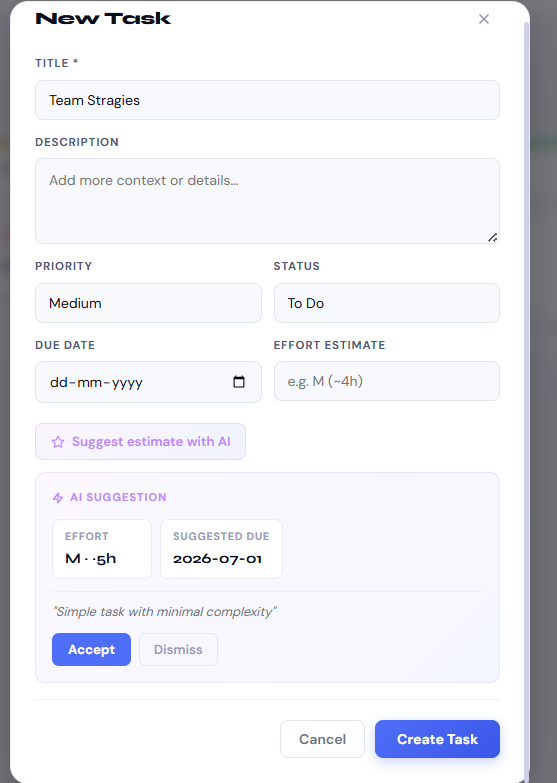

# TaskFlow

A full-stack task and project management application built from scratch. Users can register, create boards, manage tasks across Kanban columns, set priorities and due dates, and get AI-powered effort estimates — all persisted on the server with secure authentication.

---

## Live Demo

| | URL |
|---|---|
| Frontend | https://task-flow-xi-peach.vercel.app |
| Backend API | https://taskflow-apwk.onrender.com |
| Repository | https://github.com/vanshkhandelwal7561-ai/TaskFlow |

**Test credentials**
```
Email:    jane2@gmail.com
Password: 123456
```
Or register a new account directly.

---

## Screenshots

### Login


### Dashboard


### Board — Kanban View


### AI Estimate


---

## Tech Stack

### Frontend
| Library | Purpose |
|---|---|
| React 18 | UI framework with functional components and hooks |
| React Router v6 | Client-side routing and protected routes |
| Axios | HTTP client with JWT interceptors |
| react-hot-toast | Non-blocking notification system |
| date-fns | Date formatting and overdue detection |
| Lucide React | Icon library |

### Backend
| Library | Purpose |
|---|---|
| Node.js + Express | REST API server |
| MongoDB + Mongoose | Database and ODM with schema validation |
| bcryptjs | Password hashing with 12 salt rounds |
| jsonwebtoken | JWT generation and verification |
| express-validator | Server-side input validation |
| express-async-errors | Automatic async error propagation |
| groq-sdk | Groq API client for AI integration |

### Infrastructure
| Service | Purpose |
|---|---|
| MongoDB Atlas | Hosted database (M0 free tier) |
| Render | Backend hosting (free tier) |
| Vercel | Frontend hosting with automatic deployments |

---

## Features

**Authentication**
- Register and login with email and password
- Passwords hashed with bcrypt — never stored in plain text
- JWT issued on login, stored in localStorage, attached to every request
- Protected routes redirect unauthenticated users to login
- Token verified on every protected API call

**Boards**
- Create, rename, and delete boards
- Delete confirmation before destructive actions
- Cascade delete — removing a board removes all its tasks
- Task count displayed on each board card
- Empty state with call to action

**Tasks and Kanban**
- Three-column Kanban board: To Do, In Progress, Done
- Create and edit tasks with title, description, priority, due date, and effort estimate
- Move tasks between columns with one click
- Filter by priority, sort by creation date, due date, or priority
- Overdue tasks highlighted visually with red accent
- Skeleton loaders while data is being fetched

**AI Estimate**
- Click "Suggest estimate with AI" on any task form
- Backend calls Groq (LLaMA 3.3 70B) with task title and description
- Returns effort size (S / M / L / XL), estimated hours, suggested due date, and reasoning
- User can accept (auto-fills fields) or dismiss
- Graceful fallback if API key is missing or call fails — app never breaks

**UI and UX**
- Dark mode and light mode toggle, persisted to localStorage
- Fully responsive — works on mobile, tablet, and desktop
- Toast notifications for all actions
- Consistent error messages for validation, network, and auth failures
- Custom 404 page

---

## AI Integration

The AI feature uses the **Groq API** with the `llama-3.3-70b-versatile` model.

**Why Groq over Gemini or OpenAI:**
- Free tier requires no credit card
- Inference is significantly faster than comparable free options
- LLaMA 3.3 70B returns clean, structured JSON reliably
- Simple SDK with straightforward error handling

**Flow:**
1. User clicks "Suggest estimate with AI" on the task form
2. Frontend sends `POST /api/ai/suggest` with task title and description
3. Backend constructs a structured prompt and calls Groq
4. Response is parsed and validated on the server
5. Clean JSON is returned to the frontend: `{ effort, hours, suggestedDueDate, reasoning }`
6. User accepts or dismisses — fields are pre-filled on accept

**The API key is stored only in the backend `.env` file and never reaches the browser.**

**Fallback:** If `GROQ_API_KEY` is not set or the API call fails or times out (15 second limit), the server returns a default estimate of M / 4 hours / due in 7 days with a message indicating the AI was unavailable. The application continues to function normally.

---

## API Reference

### Authentication

| Method | Path | Auth | Description |
|---|---|---|---|
| POST | `/api/auth/register` | No | Register a new user |
| POST | `/api/auth/login` | No | Login and receive JWT |
| GET | `/api/auth/me` | Yes | Get the current user |

### Boards

| Method | Path | Auth | Description |
|---|---|---|---|
| GET | `/api/boards` | Yes | List all boards for the user |
| POST | `/api/boards` | Yes | Create a new board |
| GET | `/api/boards/:id` | Yes | Get a single board |
| PUT | `/api/boards/:id` | Yes | Update board title or description |
| DELETE | `/api/boards/:id` | Yes | Delete board and all its tasks |
| GET | `/api/boards/:id/tasks` | Yes | Get tasks for a board with optional filters |

**Query parameters for task listing:**
```
priority  low | medium | high
sortBy    createdAt | dueDate | priority
order     asc | desc
```

### Tasks

| Method | Path | Auth | Description |
|---|---|---|---|
| GET | `/api/tasks/:id` | Yes | Get a single task |
| POST | `/api/tasks` | Yes | Create a task |
| PUT | `/api/tasks/:id` | Yes | Update any task fields |
| DELETE | `/api/tasks/:id` | Yes | Delete a task |

### AI

| Method | Path | Auth | Description |
|---|---|---|---|
| POST | `/api/ai/suggest` | Yes | Get effort and due date estimate |

**Request body:**
```json
{
  "title": "Redesign the onboarding flow",
  "description": "Update all screens and copy for new users"
}
```

**Response:**
```json
{
  "success": true,
  "fallback": false,
  "data": {
    "effort": "L",
    "hours": 16,
    "suggestedDueDate": "2026-07-10",
    "reasoning": "UI redesign with copy changes typically requires multiple review cycles."
  }
}
```

### Health

| Method | Path | Description |
|---|---|---|
| GET | `/api/health` | Returns server status and timestamp |

---

## Data Models

### User
```
name          String    required, max 100 characters
email         String    required, unique, lowercase
passwordHash  String    bcrypt hash, excluded from all query responses
createdAt     Date      auto-generated
updatedAt     Date      auto-generated
```

### Board
```
title         String    required, max 150 characters
description   String    optional, max 500 characters
owner         ObjectId  reference to User
taskCount     Virtual   populated on request, not stored
createdAt     Date      auto-generated
updatedAt     Date      auto-generated
```

### Task
```
title            String    required, max 200 characters
description      String    optional, max 2000 characters
status           Enum      todo | in-progress | done  (default: todo)
priority         Enum      low | medium | high  (default: medium)
dueDate          Date      optional
estimatedEffort  String    optional, e.g. "M (~4h)"
aiSuggestion     Object    { effort, hours, suggestedDueDate, reasoning }
board            ObjectId  reference to Board
owner            ObjectId  reference to User
isOverdue        Virtual   computed from dueDate and status, not stored
createdAt        Date      auto-generated
updatedAt        Date      auto-generated
```

---

## Local Setup

### Prerequisites
- Node.js v18 or higher
- A MongoDB Atlas account (free tier)
- A Groq API key (free at console.groq.com)

### 1. Clone the repository

```bash
git clone https://github.com/vanshkhandelwal7561-ai/TaskFlow.git
cd TaskFlow
```

### 2. Set up the backend

```bash
cd Backend
npm install
cp .env.example .env
```

Open `.env` and fill in your values:

```env
PORT=5000
NODE_ENV=development
MONGODB_URI=mongodb+srv://<username>:<password>@cluster.mongodb.net/taskFlow
JWT_SECRET=a_long_random_string_minimum_32_characters
JWT_EXPIRES_IN=7d
GROQ_API_KEY=gsk_your_key_here
CLIENT_URL=http://localhost:3000
```

```bash
node src/index.js
```

The API will be available at `http://localhost:5000`. Verify with `http://localhost:5000/api/health`.

### 3. Set up the frontend

```bash
cd ../Frontend
npm install
```

Create a `.env` file:

```env
REACT_APP_API_URL=http://localhost:5000/api
```

```bash
npm start
```

The app will open at `http://localhost:3000`.

---

## Deployment

### Backend on Render
1. Create a new Web Service and connect the GitHub repository
2. Set the root directory to `Backend`
3. Build command: `npm install`
4. Start command: `node src/index.js`
5. Add all environment variables from `.env.example` in the Render dashboard

### Frontend on Vercel
1. Import the GitHub repository into Vercel
2. Set the root directory to `Frontend`
3. Add one environment variable: `REACT_APP_API_URL=https://taskflow-apwk.onrender.com/api`
4. Deploy

### Database
MongoDB Atlas M0 free cluster. Under Network Access, allow `0.0.0.0/0` so Render can connect.

---

## Security Notes

- Passwords are hashed with bcrypt at 12 salt rounds before storage
- JWT tokens are signed with a secret and expire after 7 days
- Every protected route runs `authMiddleware` which verifies the token and fetches the user
- Every board and task query filters by `owner` — users cannot access each other's data
- The Groq API key exists only in the server environment and is never sent to the client
- All incoming request data is validated with `express-validator` before reaching controllers
- Request body size is capped at 10kb to prevent payload attacks
- The `X-Powered-By` header is disabled to avoid exposing the framework

---

## Project Structure

```
TaskFlow/
├── Backend/server
│   ├── src/
│   │   ├── controllers/
│   │   │   ├── authController.js
│   │   │   ├── boardController.js
│   │   │   ├── taskController.js
│   │   │   └── aiController.js
│   │   ├── middleware/
│   │   │   ├── authMiddleware.js
│   │   │   ├── errorHandler.js
│   │   │   └── validate.js
│   │   ├── models/
│   │   │   ├── User.js
│   │   │   ├── Board.js
│   │   │   └── Task.js
│   │   ├── routes/
│   │   │   ├── auth.js
│   │   │   ├── boards.js
│   │   │   ├── tasks.js
│   │   │   └── ai.js
│   │   ├── utils/
│   │   │   ├── db.js
│   │   │   ├── jwt.js
│   │   │   └── ApiError.js
│   │   └── index.js
│   ├── .env.example
│   └── package.json
│
├── Frontend/client 
│   ├── src/
│   │   ├── api/
│   │   │   ├── axios.js
│   │   │   └── index.js
│   │   ├── context/
│   │   │   ├── AuthContext.js
│   │   │   └── ThemeContext.js
│   │   ├── components/
│   │   │   ├── layout/
│   │   │   │   └── Layout.js
│   │   │   └── ui/
│   │   │       ├── BoardCard.js
│   │   │       ├── BoardModal.js
│   │   │       ├── Button.js
│   │   │       ├── Modal.js
│   │   │       ├── Skeleton.js
│   │   │       ├── TaskCard.js
│   │   │       └── TaskModal.js
│   │   ├── pages/
│   │   │   ├── LoginPage.js
│   │   │   ├── RegisterPage.js
│   │   │   ├── DashboardPage.js
│   │   │   ├── BoardPage.js
│   │   │   └── NotFoundPage.js
│   │   ├── App.js
│   │   └── index.js
│   ├── .env.example
│   └── package.json
│
├── screenshots/
│   ├── login.png
│   ├── dashboard.png
│   ├── board.png
│   └── ai.png
│
└── README.md
```

---

## Known Limitations

- Tasks are moved between columns via buttons rather than drag and drop
- No team collaboration — each account is independent
- Render free tier spins down after inactivity — the first request after a period of inactivity may take 30 to 60 seconds to respond
- No email verification on registration
- No pagination on large task lists

## What I Would Improve With More Time

- Drag-and-drop column reordering with dnd-kit
- Real-time updates using WebSockets
- Team workspaces with member invites and role-based permissions
- Task comments and file attachments
- Email reminders for approaching due dates
- Unit and integration test coverage with Jest and Supertest
- Full TypeScript migration across frontend and backend
- Activity log per board

---
